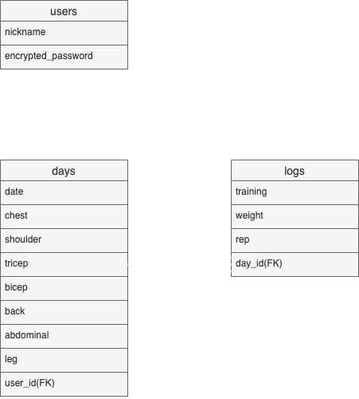

# README

## アプリケーション名
TORELOG(トレログ)

## 概要
トレーニング記録の保存、確認を行うためのアプリ
### 期待効果
成長・成果の見える化を行うことで、ユーザーのトレーニングに対するモチベーション維持と効率化を実現する

## URL
https://torelog.herokuapp.com/
### テスト用アカウント
・ニックネーム : テストユーザー<br>
・パスワード : testpass2021

## 要件定義
### ヘッダー
- 左上にアプリのロゴがあり、クリックするとトップページに遷移する
- 右上に「新規登録」「ログイン」「ログアウト」のリンクボタンを配置
  - ユーザーがログインしていない時は「新規登録」「ログイン」ボタンを表示
  - ユーザーがログインしている時は「ログアウト」ボタンを表示
### トップページ
- 「トレーニング記録入力」「トレーニング記録確認」「オプション」画面へのリンクを配置
### トレーニング記録入力
- 「日付」「ターゲット」「種目」「重量」「レップ」を入力するフォームを配置
- 日付フォーム
  - 本日の日付が初期値として入力されている
  - カレンダー選択方式で入力
- ターゲットフォーム
  - 「胸」「肩」「上腕三頭筋」「上腕二頭筋」「背中」「腹筋」「脚」をチェックボックス
  - 複数選択可能
  - 何も選択されていない場合はエラーが発生する
- 種目・重量・レップフォーム
  - 全ての項目が正常に入力されている場合、保存される
  - 「セット追加」ボタンをクリックするとフォームが追加される
  - フォーム右側の「削除」ボタンをクリックするとフォームが削除される
  - フォームが5つ以上になるとスクロール対応する
- 「入力完了」ボタンを押すとデータの保存、トレーニング記録確認(詳細)に遷移する
- 「BACK」ボタンを押すとトップページに遷移する
### トレーニング記録確認
- 「検索フォーム」と「記録一覧」が表示されている
#### 検索フォーム
- 「日付」「ターゲット」から検索可能
  - 日付フォーム
    - 始点~終点で範囲検索ができる
  - ターゲット
    - チェックボックス式
    - 複数選択可能
#### 一覧表示
- 「日付」「ターゲット」「EDITボタン」「DELETEボタン」を表示
  - 日付をクリックすると詳細確認画面に遷移する
  - ターゲット部位は「◯」マークを表示する
  - EDITボタンをクリックすると「日付」と「ターゲット」を編集する画面に遷移する
  - DELETEボタンを押すとその行のトレーニング記録を削除
    - 削除前に確認アラートを表示
#### 詳細表示
- 上部に「日付」「ターゲット」を表示、中部にトレーニング記録を表示、下部に「EDIT」「DELETE」「BACK」ボタンを表示
  - 「EDIT」ボタンを押すとトレーニング記録編集画面に遷移
  - 「DELETE」ボタンを押すとトレーニング記録を削除
    - 削除前に確認アラートを表示
### オプション
- 「トレーニング記録の全削除」「ユーザーの削除」「BACK」ボタンを表示
  - 「トレーニング記録の全削除」「ユーザーの削除」は削除前にアラートメッセージを表示
  - 「BACK」をクリックするとトップページに遷移

### 今後実装予定の機能
- ユーザー情報編集機能
- トレーニング種目から記録の逆検索
- トレーニングメニューのレコメンド機能

## 利用方法
### ユーザー管理機能
#### 新規ユーザー登録
- 画面右上の「新規登録」をクリックして「新規ユーザー登録画面」に遷移
- 画面指示に応じて「ニックネーム」「パスワード」「パスワード(確認)」を入力
- 画面下部の「新規登録」ボタンをクリック
※ エラーが発生した際はエラーメッセージを参考に入力内容を修正
#### ログイン
- 画面右上の「ログイン」をクリックして「ログイン画面」に遷移
- 「ニックネーム」「パスワード」を入力
- 「ログイン」ボタンをクリック
※ エラーが発生した際はエラーメッセージを参考に入力内容を修正
#### ログアウト
- 画面右上の「ログアウト」をクリック
- 画面右上に「ログイン」「新規登録」が表示されていればログイン可能
#### ユーザー削除
- トップページ下部の「オプション」をクリック
- 「ユーザーの削除」をクリック
- 確認アラートの「はい」をクリック
### トレーニング記録機能
本機能はログイン時のみ実行可能
#### 新規登録
- トップページの「トレーニング記録入力」をクリックして「トレーニング記録入力(新規)画面」に遷移
- 「日付」「ターゲット」「種目」「重量」「レップ」を入力
  - セット追加、削除は下記GIFを参考
    - https://gyazo.com/59c56eb523cb1b5e655946de35610d91
- 「入力完了」をクリック
※ エラーが発生した際はエラーメッセージを参考に入力内容を修正
#### 確認
- トップページの「トレーニング記録確認」をクリックして「トレーニング記録画面」に遷移
- 特定の日付の詳細(トレーニング内容)を確認したい場合は日付をクリックする
#### 編集
##### トレーニング実施日
- 「トレーニング記録確認画面」の「EDIT」をクリックして「トレーニング実施日(編集)」に遷移
- 「日付」と「ターゲット」を編集
- 「編集終了」をクリック
※ エラーが発生した際はエラーメッセージを参考に入力内容を修正
##### トレーニング記録
- トレーニング実施日一覧の「日付」、または「トレーニング実施日(編集)画面」の「トレーニング内容確認」をクリックして「トレーニング記録の詳細画面」に遷移
- 画面下部の「EDIT」をクリックして「トレーニング記録(編集)画面に遷移」
- 「種目」「重量」「レップ」の修正、削除、追加を行う
- 「編集終了」をクリック
#### 削除
##### トレーニング実施日
- 「トレーニング記録確認画面」の「DELETE」をクリック
- アラートメッセージの「はい」をクリック
##### トレーニング記録
- トレーニング実施日一覧の「日付」、または「トレーニング実施日(編集)画面」の「トレーニング内容確認」をクリックして「トレーニング記録の詳細画面」に遷移
- 画面下部の「DELETE」をクリック
- アラートメッセージの「はい」をクリック
##### 全削除
- トップページの「オプション」をクリックして「オプション画面」に遷移
- 「トレーニング記録の全削除」をクリック
- アラートメッセージの「はい」をクリック

## テーブル設計
### ER図


### usersテーブル
| Column             | Type   | Options                   | 
| ------------------ | ------ | ------------------------- | 
| nickname           | string | null: false, unique: true | 
| encrypted_password | string | null: false               | 

#### Association
has_many :days, dependent: :destroy

### daysテーブル
| Column        | Type       | Options                        | 
| ------------- | ---------- | ------------------------------ | 
| date          | date       | null: false                    | 
| chest         | boolean    |                                | 
| shoulder      | boolean    |                                | 
| tricep        | boolean    |                                | 
| bicep         | boolean    |                                | 
| back          | boolean    |                                | 
| abdominal     | boolean    |                                | 
| leg           | boolean    |                                | 
| user_id       | references | null: false, foreign_key: true | 

#### Association
belongs_to :user<br>
has_many :logs, dependent: :destroy
accepts_nested_attributes_for :logs, reject_if: :all_blank, allow_destroy: true

### logsテーブル
| Column   | Type       | Options                        | 
| -------- | ---------- | ------------------------------ | 
| training | string     | null: false                    | 
| weight   | float      | null: false                    | 
| rep      | integer    | null: false                    | 
| day_id   | references | null: false, foreign_key: true | 

#### Association
belongs_to :day

## ローカルでの動作方法
### 環境
- macOS Catalina
- rails 6.0.0
- ruby 2.6.5
- mysql2 0.4.4

### 実行手順
1. アプリケーションclone
```
% git clone https://github.com/tarotakano9/torelog.git
% cd torelog
% bundle install
% yarn install
% rails db:create
% rails db:migrate
```
2. 動作確認
```
% rails s
```
サーバーを立ち上げて動作を確認
